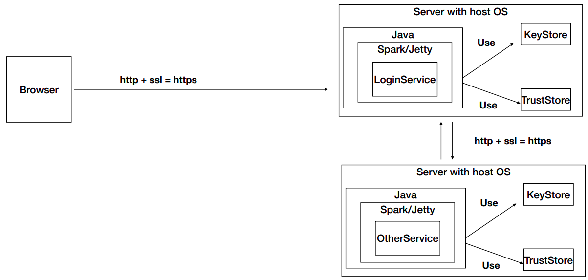
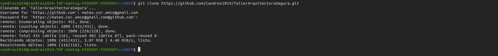
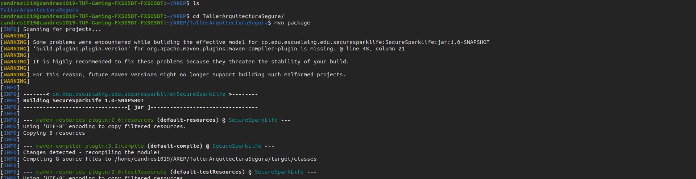
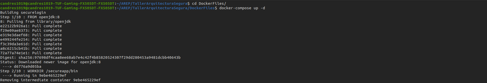
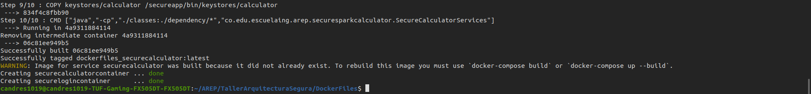
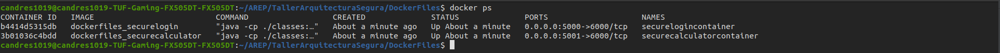
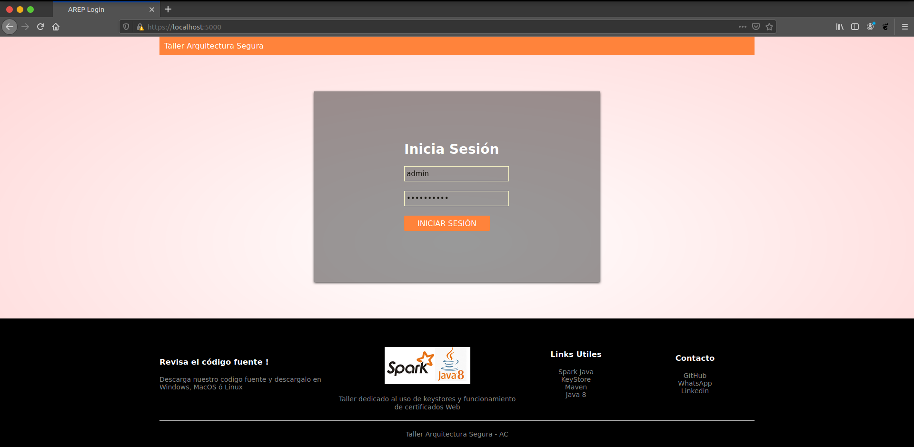

# Taller Aplicación Distribuida Segura en todos sus Frentes

Aplicativo Web diseñado en Java haciendo uso del framework Spark con el objetivo de realizar la implementación y uso de
certificados SSL y el uso del protocolo HTTPS, con una arquitectura basada en 2 nodos que se comunicaran entre sí
haciendo uso de estos certificados (SSL), uno de ellos encargado de prestar un servicio el cual en este caso es una
calculadora encargada de retornar la media y la desviación estándar de un conjunto n de datos, y el segundo nodo
encargado de enviar al primero la cadena de datos con la cual este va a trabajar y de brindar adicionalmente un soporte
a usuarios, los cuales serán capaces de hacer login y hacer logout, este nodo además será el encargado de llevar un
control sobre las sesiones de estos usuarios y de encriptar las contraseñas de los mismos.

## Información Del Proyecto

* La documentación del las clases y los metodos del proyecto se encuentran en el directorio adjunto /Javadoc/apidocs.

### Pre-Requisitos

Para correr este proyecto necesita los siguientes programas instalados, se adjuntan los links de como descargarlos:

> * [Como Instalar Java 8](https://www.oracle.com/co/java/technologies/javase/javase-jdk8-downloads.html)
> * [Como Instalar Apache Maven](http://maven.apache.org/download.html#Installation)
> * [Como Instalar Docker](https://docs.docker.com/engine/install/)

Adicionalmente se recomienda tener descargado los siguientes programas:

> * [Como Instalar Git](http://git-scm.com/book/en/v2/Getting-Started-Installing-Git)

### Video del despliegue en AWS

[](https://www.youtube.com/watch?v=Q9Yq7MxHnko)

### Calidad del código

[](https://www.codacy.com/gh/Candres1019/TallerClientesServicios/dashboard?utm_source=github.com&amp;utm_medium=referral&amp;utm_content=Candres1019/TallerClientesServicios&amp;utm_campaign=Badge_Grade)

### Integración Continua

[](https://app.circleci.com/pipelines/github/Candres1019/TallerArquitecturaSegura)

### Arquitectura

La arquitectura del aplicativo se basa en el siguiente modelo:



La arquitectura de la seguridad de este aplicativo se basa esencialmente en el uso de certificados web, con el cual sé
mantiene un control estricto de los servicios a los cuales se puede acceder de manera local y remota, esto permite tener
un control sobre que servicios se están ofreciendo y consumiendo internamente, además de poder guardar los servicios que
no queremos que sean expuestos, como se puede visualizar en el diagrama de la arquitectura cada servicio ofrecido ase
uso de sus propios "KeyStore" y "TrustStore".

En él [directorio](./keystores) se encuentran almacenados los certificados y los TrustStore de los dos servicios
ofrecidos, la manera más óptima y más fácil de ampliar esta arquitectura es haciendo uso de los mismos, para agregar un
nuevo servicio, se crearían "KeyStore" y "TrustStore" nuevos para cada servicio y agregando los certificados que
correspondan a cada uno de ellos.

Por último y como segundo nivel de seguridad se tiene un servicio de login el cual bloquea el uso de servicios si no sé
encuentra una sesión activada, además de esto cifra las contraseñas de los usuarios haciendo uso de la función Hash
SHA256

### Instalación

Nota: Para la instalación debe estar corriendo de manera correcta Docker

1. Clonación o Descarga del Proyecto:

    * Para **Clonar** el proyecto utilice el siguiente comando en la ventana de comandos:

   > ```
   > git clone https://github.com/Candres1019/TallerArquitecturaSegura.git
   > ```

    * Para **Descargar** el proyecto de
      click [aquí](https://github.com/Candres1019/TallerArquitecturaSegura/archive/refs/heads/main.zip), la descarga
      comenzará de manera automática.

   > Debería visualizar algo como lo siguiente:
   >
   > 

2. En una ventana de comandos ejecuté el siguiente comando, dentro de la carpeta principal del proyecto:

   > ```
    > mvn package
    > ```

   > Debería visualizar algo como lo siguiente:
   >
   > 


3. Para ejecutar la aplicación de manera local utilizamos en la ventana de comandos el siguiente comando dentro del
   directorio DockerFiles:

   > ```
    > docker-compose up -d
    > ```

   > Debería visualizar algo como lo siguiente al inicio de la ejecución:
   >
   > 
   >
   > Debería visualizar algo como lo siguiente al final de la ejecución:
   >
   > 

4. Para verificar que todo esté funcionando de manera correcta ejecutamos el siguiente comando:

   > ```
    > docker ps
    > ```

   > Debería visualizar lo siguiente:
   >
   > 

5. Para ver el aplicativo web de manera local ingresamos al siguiente enlace (Se recomienda usar firefox):

   > ```
    > https://localhost:5000/
    > ```

   > Debería visualizar lo siguiente:
   >
   > 

6. Por defecto se creó la documentación JavaDoc y fue dejada en el directorio /Javadoc, si desea generar uno nuevo
   utilice el siguiente comando, esta documentación quedará en el directorio /target/site/apidocs :

   > ```
   > mvn javadoc:javadoc
   > ```

## Ejecución de pruebas

En una ventana de comandos, utilice el siguiente comando:

   ```
    mvn test
   ```

## Construido Con

* [Java](https://www.java.com/es/) - Lenguaje de Programación.
* [JUnit](https://junit.org/junit5/) - Pruebas de Unidad.
* [Maven](https://maven.apache.org/) - Manejo de dependencias.
* [IntelliJ IDEA](https://www.jetbrains.com/es-es/idea/) - Entorno de Desarrollo.

## Authors

* **Andres Mateo Calderón Ortega** - [Candres1019](https://github.com/Candres1019)

# Licencia

Este proyecto está licenciado bajo la GNU v3.0 - ver el archivo [LICENSE](./LICENSE) para más detalles.